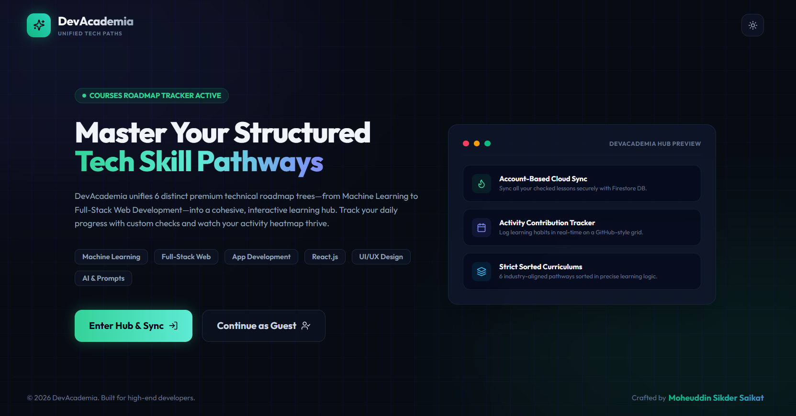

<div align="center">

<br/>

```
  _____  ______      __            _____          _____  ______ __  __ _____          
 |  __ \|  ____|     \ \          / ____|   /\   |  __ \|  ____|  \/  |_   _|   /\    
 | |  | | |__   __   _\ \        | |       /  \  | |  | | |__  | \  / | | |    /  \   
 | |  | |  __|  \ \ / /\ \       | |      / /\ \ | |  | |  __| | |\/| | | |   / /\ \  
 | |__| | |____  \ V /  \ \      | |____ / ____ \| |__| | |____| |  | |_| |_ / ____ \ 
 |_____/|______|  \_/    \_\      \_____/_/    \_\_____/|______|_|  |_|_____/_/    \_\
```

<br/>

**Six premium technical roadmaps. One unified workspace. Engineered for calm. Designed for focus.**

<br/>

[](https://dev-academia-live.vercel.app/)

<br/>



<br/>

</div>

---

<br/>

<div align="center">

### *"A developer's progress tracker should not be a scattered collection of bookmarks.*
### *It should be a high-performance workspace that inspires mastery."*

</div>

<br/>

---

<br/>

## ◈ &nbsp; What is DevAcademia?

DevAcademia is not another static resource checklist. It is a **hand-crafted learning operating system** designed to centralize technical self-education. Built from the ground up to solve "tutorial hell," it unifies six distinct, premium curriculum paths—spanning Machine Learning, Full-Stack Web Development, Mobile Engineering, React.js, UI/UX Design, and Generative AI—into a single highly interactive, beautiful browser interface.

Every daily check, progress stat, and activity streak is calculated locally and synchronized securely with the cloud, creating a visual, habit-forming workspace that turns learning consistency into a reward.

<br/>

---

<br/>

## ◈ &nbsp; Feature Architecture

<br/>

<table>
<tr>
<td width="50%" valign="top">

### 🧠 &nbsp; Curated Roadmap Engine

Structured pathways to master modern technical skills step-by-step.

- **Dynamic Week-by-Week Accordions** to manage learning states
- **Context-aware sub-sections** separating practice exercises from projects
- **Auto-calculating statistics** displaying exact percentage updates per path
- Instant course swaps keeping your central focus clean

</td>
<td width="50%" valign="top">

### 📅 &nbsp; Live Contribution Heatmap

A visual index of your study consistency, built to motivate.

- **53-week Sunday-to-Saturday grid** mapping daily task completions
- **Dynamic HSL-scaled green cells** representing work density in real-time
- **Interactive detail drawer** displaying specific tasks completed on click
- Comprehensive streak engines calculating consecutive active days

</td>
</tr>
<tr>
<td width="50%" valign="top">

### 🔒 &nbsp; Account-Based Cloud Sync

Secure state management that respects your work and time.

- **Premium Sync Merge Policy** protecting active guest session logs
- **Real-time Firestore synchronization** bound strictly to user document scopes
- **Automatic offline local persistence** preventing data loss during drops
- Fast account setup and fluid sign-in configurations

</td>
<td width="50%" valign="top">

### 💼 &nbsp; Full Data Sovereignty

Complete authority over your own educational database metrics.

- **JSON Data Export** to download your absolute progress locally
- **JSON Data Import** to restore all records on completely new systems
- One-click progress wipes for synchronized hard resets
- Premium frosted glass aesthetics adapting to custom light/dark modes

</td>
</tr>
</table>

<br/>

---

<br/>

## ◈ &nbsp; Curriculum Matrix

<br/>

| Pathway | Core Focus Area | Scope | Structure |
|---|---|---|---|
| 🧠 **Machine Learning** | Classical models $\to$ Deep Ops | Python basics $\to$ Pandas $\to$ Scikit $\to$ FastAPI Ops | 3-Month Rigorous Track |
| 🌐 **Full-Stack Web Dev** | Core engines $\to$ Databases | HTML/JS $\to$ React hooks $\to$ Express APIs $\to$ Postgres | Foundations $\to$ Advanced |
| 📱 **Mobile App Dev** | Multiplatform $\to$ Device API | Native layout architectures $\to$ Flutter $\to$ React Native | OS-level safe integrations |
| ⚛️ **React.js Simple** | Component state $\to$ Hooks | JSX $\to$ State lifecycle $\to$ Custom contexts $\to$ 4 Projects | 30-Day Intensive |
| 🎨 **UI/UX Design** | Visual psychology $\to$ Wireframes | Empathy mapping $\to$ Prototyping $\to$ Auto-layouts in Figma | Wireframing $\to$ Hi-Fi |
| ✨ **AI & Prompting** | LLM orchestrations $\to$ Vector DBs | Cosine metrics $\to$ Pinecone/Chroma $\to$ Agentic RAG apps | Advanced prompting & ops |

<br/>

---

<br/>

## ◈ &nbsp; Gamification & Habit Loop

Visualizing continuous self-education creates a highly addictive progress loop. DevAcademia's interactive activity calendar translates your checks into high-end indicators:

```text
  [Mon]  ░░  ██  ░░  ░░  ██  ▓▓  ░░  ██  ██  ░░  ██  ▓▓  ░░  ██  ░░
  [Wed]  ░░  ░░  ██  ░░  ██  ░░  ░░  ██  ░░  ░░  ██  ░░  ░░  ██  ██
  [Fri]  ██  ░░  ██  ██  ░░  ██  ▓▓  ░░  ██  ██  ░░  ██  ▓▓  ░░  ██
         └───────────── Month 1 ─────────────┘ └───────────── Month 2 ─────────────┘
```
$$\text{\small Grid Legend: \ \ } \color{#1e293b}{\blacksquare}\ \text{0 tasks (Rest)} \quad \color{#064e3b}{\blacksquare}\ \text{1 task (Light)} \quad \color{#047857}{\blacksquare}\ \text{2-4 tasks (Medium)} \quad \color{#10b981}{\blacksquare}\ \text{5-9 tasks (High)} \quad \color{#34d399}{\blacksquare}\ \text{10+ tasks (Intense Studio)}$$

<br/>

---

<br/>

## ◈ &nbsp; Tech Stack

<br/>

<div align="center">


&nbsp;

&nbsp;

&nbsp;

&nbsp;

&nbsp;


</div>

<br/>

```
           React  ──  Functional component structures & dynamic custom state hooks
    Tailwind CSS  ──  Premium glassmorphic dashboard UI with adaptive theme grids
  Cloud Firestore  ──  Realtime NoSQL sync bound securely to user document scopes
    Lucide React  ──  Lightweight SVG vector icon mappings for dynamic roadmaps
            Vite  ──  Next-generation dev server for seamless hot-module updates
          Python  ──  Data compilation scripts (parse_roadmaps.py) using BeautifulSoup
```

<br/>

---

<br/>

## ◈ &nbsp; Getting Started

```bash
# Clone the repository
git clone https://github.com/Mohiuddin0035/unified-roadmap-dashboard.git

# Navigate to the workspace
cd unified-roadmap-dashboard

# Install NPM dependencies
npm install

# Start the interactive dev server
npm run dev
```

> **Note:** The application comes configured with a live developer demo Firebase sandbox database. If you wish to plug in your own Firestore database, configure your custom keys inside [src/firebase.js](file:///c:/Users/user/Desktop/New%20folder/src/firebase.js) exactly as specified.

<br/>

---

<br/>

## ◈ &nbsp; Design Philosophy

<br/>

<div align="center">

```
  AESTHETICS  ───────────────────────────────────────────────  UTILITY

    Vibrant theme signatures             Strict database sync logic
    Dynamic glassmorphism                Intelligent local session merge
    Ambient grid background              Decoupled, private security
    Breathes with active glows           Full JSON backup controls
```

</div>

<br/>

DevAcademia was built on a single core belief: **a developer's relationship with their progress tracker should feel creative, visually inspiring, and entirely secure.** The interface disappears into frosted columns when you are reading content, and lights up with custom HSL glow gradients when you hit milestones. 

Aesthetics are not secondary here—they are the driver of learning discipline.

<br/>

---

<br/>

<div align="center">

## ◈ &nbsp; About the Developer

<br/>

<table>
<tr>
<td align="center">

<br/>

**MOHEUDDIN SIKDER SAIKAT**

*Designer &nbsp;·&nbsp; Developer &nbsp;·&nbsp; Software Engineer*

<br/>

[](https://uiu.ac.bd)
&nbsp;
[](https://uiu.ac.bd)
&nbsp;
[](https://github.com/Mohiuddin0035)

<br/>

[](https://github.com/Mohiuddin0035)
&nbsp;
[](https://www.linkedin.com/in/moheuddin-saikat)
&nbsp;
[](https://www.facebook.com/mohiuddin.s.saikat2.o)
&nbsp;
[](mailto:msaikat2420035@bscse.uiu.ac.bd)

<br/>

</td>
</tr>
</table>

<br/>

---

`React` &nbsp;·&nbsp; `Tailwind CSS` &nbsp;·&nbsp; `Glassmorphism` &nbsp;·&nbsp; `Lucide` &nbsp;·&nbsp; `Cloud Firestore` &nbsp;·&nbsp; `Vite` &nbsp;·&nbsp; `Python`

<br/>

*© 2026 Moheuddin Sikder Saikat — DevAcademia. All rights reserved.*

</div>
